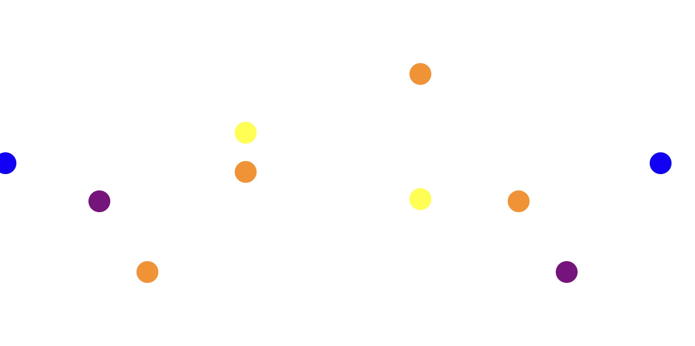

<h1>Ball Animation With Javascript ES6</h1>

This code animates bouncing balls within the boundaries of the browsers width and height. This code originate from a code challenge in Week #3 of MIT's MERN Coding Bootcamp. The challenge was to add features. As a result of this challenge the following features were added

<h2>Features</h2>
<ul>
<li>Boundaries Adjust to width and height of the browser window when it loads and when the window is resized</li>
<li>Balls are created in pairs with random colors</li>
<li>A prompt provides for users to input the number of ball pairs to create</li>
<li>Each Double click of the mouse in the browser window will create a pair of balls with random colors</li>
<li>All the inline Javascript was moved to a separate file</li>
</ul>
<h2>How to Use</h2>
<ol>
<li>Fork the project then Copy or clone the Index, JS, and Style files to a folder on your PC</li>
<li>Open the index file with your browser</li>
<li>When prompted enter the number of pairs of Balls you want created or select cancel</li>
<li>Double click your mouse in the browser window for each pair of balls you want created</li>
<li>Refresh the browser window to start over</li>
<li>Close your Browser window when finished</li>
</ol>
<h2>Roadmap</h2>

Exploring ideas for additional features such as adding friction and balls bouncing off each other

<h2>Contributors</h2>
<ul>
  <li>Bill Conley</li>
  <li>Dr John Williams</li>
 </ul>
 <h2>License</h2>
 
MIT License

  
Copyright (c) 2021 Bill Conley

  
Permission is hereby granted, free of charge, to any person obtaining a copy
of this software and associated documentation files (the "Software"), to deal
in the Software without restriction, including without limitation the rights
to use, copy, modify, merge, publish, distribute, sublicense, and/or sell
copies of the Software, and to permit persons to whom the Software is
furnished to do so, subject to the following conditions:

  
The above copyright notice and this permission notice shall be included in all
copies or substantial portions of the Software.

  
THE SOFTWARE IS PROVIDED "AS IS", WITHOUT WARRANTY OF ANY KIND, EXPRESS OR
IMPLIED, INCLUDING BUT NOT LIMITED TO THE WARRANTIES OF MERCHANTABILITY,
FITNESS FOR A PARTICULAR PURPOSE AND NON-INFRINGEMENT. IN NO EVENT SHALL THE
AUTHORS OR COPYRIGHT HOLDERS BE LIABLE FOR ANY CLAIM, DAMAGES OR OTHER
LIABILITY, WHETHER IN AN ACTION OF CONTRACT, TORT OR OTHERWISE, ARISING FROM,
OUT OF OR IN CONNECTION WITH THE SOFTWARE OR THE USE OR OTHER DEALINGS IN THE
SOFTWARE.

